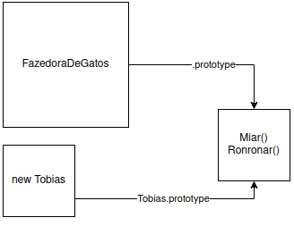
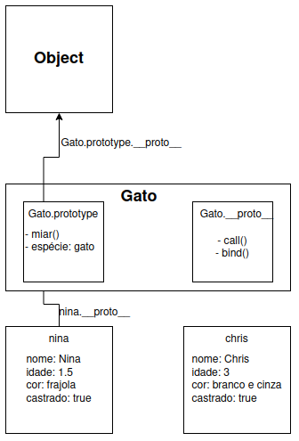

# 4.1 - Herança e Protótipos

## Relembrando a definição de protótipo
Usamos um protótipos no JavaScript para estender um construtor, adicionando nele propriedades e métodos que serão compartilhados entre os objetos criados por ele. O prototipe de um objeto é uma fonte "reserva" de informações, que usa os acessos por referência como um jeito vantajoso de compartilhar código. Isso nos ajuda a atualizar nossos objetos com mais facilidade e a ter consistência entre instâncias.


## Herança em JavaScript
A herança em JavaScript é a capacidade dos nossos objetos de acessar informações que foram definidas e estão disponíveis fora deles.

## Herança com Protótipos
No JavaScript, protótipos são o único mecanismo de herança disponível, e ajudam nosso código a ficar mais limpo: temos menos repetição e melhor mantenabilidade e eficiência. Relacionamentos prototípicos só estão disponíveis para objetos, e cada objeto só pode herdar de **um** protótipo. Essa herança também não pode ser circular (ex: **A** herda de **B**, **B** herda de **C** e C herda novamente de **A**).
Para usar, devemos criar nossas categorias do menos específico (`Animal`) para o mais específico (`Gatos`, `Cachorros`).

### Exemplo de herança com protótipos (pseudoclássica)
```
function Gato(nome, idade, cor, castrado) {
    this.nome = nome
    this.idade = idade
    this.cor = cor
    this.castrado = castrado
}

Gato.prototype.miar = () => { console.log("Miau :3") }
Gato.prototype.especie = "gato"

let nina = new Gato("Nina", 1.5, "frajola", true)
let chris = new Gato("Chris", 3, "branco e cinza", true)

// propriedades da Nina
nina.nome //"Nina"

//propriedades dos gatos
nina.miar() // "Miau :3"
nina.especie // "gato"
chris.especie // "gato"

Gato.prototype.aprontando = true
chris.aprontando // true

// de onde vem isso? :0
nina.toString() // "[object Object]"
```

## `__proto__` ou `.prototype`?
 Usamos `__proto__` para acessar a **propriedade prototype de um objeto**. Essa propriedade contém a referência para as informações que compartilhamos entre vários objetos. Também podemos acessá-la usando `Object.getPrototypeOf(meuObjeto)`.
 Usamos `.prototype` para atrelar métodos a uma função que serão ligados ao `__proto__` de todos os objetos gerados quando essa função for usada como construtor. Como funções são objetos, elas também tem seu próprio `__proto__`.

 > Não é mais recomendado usar `__proto__` para acessar o prototype de um objeto. Use `Object.getPrototypeOf(seuObj)` ao invés :D

## Cadeia de protótipos
Objetos usados como protótipo também podem ter seu próprio `prototype` - isso é a cadeia de protótipos. O sistema de herança em JavaScript abstrai parte do funcionamento desse sistema, fazendo parecer que interagindo com um único objeto, ao invés de uma cadeia de objetos.

```
nina.toString() // "[object Object]"

Object.keys(nina) // Array(4) [ "nome", "idade", "cor", "castrado" ]
nina.hasOwnProperty("toString") // false

Object.keys(nina.__proto__) // Array [ "miar", "especie" ]
nina.__proto__.hasOwnProperty("toString")

nina.__proto__ == Gato.prototype // true
Gato.prototype.__proto__ == Object.prototype // true
Object.prototype.hasOwnProperty("toString")
```


Quando lidamos com uma cadeia de protótipos no JavaScript, sempre buscamos as informações do nível mais baixo para o nível mais alto. Por isso, ao modificar as propriedades de um objeto, alteramos só o objeto local e não o protótipo.

```
let wolfie = new Gato("Wolfie", 18, "malhado", false)
wolfie.miar = () => console.log("au au au")

wolfie.miar()
nina.miar()
```

Hora de fazer o exercício 1 da [lista de exercícios](../Atividades/Em%20aula/Exercicios.md)!