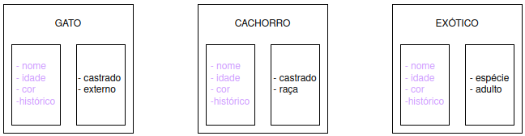

# 4.2 - As Classes do ES6

## O que é ES6?
ES6 é um encurtamento de ECMAScript 6. O nome `JavaScript` é uma marca registrada da Oracle, mas a linguagem JavaScript em si é mantida pela **E**uropean **C**omputer **M**anufactorers **A**ssociation (ECMA), uma instituição dedicada à padronização de tecnologias. A ECMA publica as especificações que usamos no JS sob o nome ECMAScript, e o ES6 foi a versão publicada em 2015. Elá está amplamente implementado nos principais navegadores.
Existe um debate acirrado sobre se ainda exste diferença entre ECMAScript e JavaScript. Para a nossa aula, podemos considerar os dois como sendo a mesma coisa.
>**Curiosidade:** A especificação mais recente do ECMAScript (junho de 2023) tem 840 páginas. Já a do HTML tem mais de **1400**!

## Instâncias, Classes e Construtores
### Instância
> Uma instância é uma unidade de um objeto de um determinado formato.
Nina, Cris, Tobias e Princeso são todos instâncias do nosso formato `Gato`. Usar `new` é um jeito de criar novas instâncias.

### Construtor
> Um construtor é uma função especial que cria um objeto (instância) a partir de uma receita (classe), retornando esse novo objeto no final da execução.
A `Gatificadora` é um construtor.

### Classe
> "A class in a program is a definition of a "type" of custom data structure that includes both data and behaviors that operate on that data." -Kyle Simpson

> "JavaScript classes are constructor functions with a prototype property." - Marijn Haverbeke

> Uma classe é como um diagrama que explica como criar um objeto de um determinado tipo. Elas descrevem como uma estrutura de dados é e funciona, mas não são por si só um dado. - Eu

## Criando objetos com classes
7. Instanciação pseudoclássica (ES6 Classes)

Relembrando como está nosso `Gato` atualmente
```
function Gato(nome, idade, cor, castrado) {
    this.nome = nome
    this.idade = idade
    this.cor = cor
    this.castrado = castrado
}

Gato.prototype.miar = () => { console.log("Miau :3") }
Gato.prototype.especie = "gato"
```

### Sintaxe tradicional
```
class Gato {
    constructor(nome, idade, cor, castrado) {
    this.nome = nome
    this.idade = idade
    this.cor = cor
    this.castrado = castrado
    }

    miar() {
        console.log("Miau :3")
    }
}

let nina = new Gato("Nina", 1.5, "frajola", true)
nina.miar() // Miau :3
```

### Sintaxe alternativa (formato de expressão)
```
let Gato = class {
    constructor(nome, idade, cor, castrado) {
    this.nome = nome
    this.idade = idade
    this.cor = cor
    this.castrado = castrado
    }

    miar() {
        console.log("Miau :3")
    }
}

let chris = new Gato("Chris", 3, "branco e cinza", true)
chris.miar() // Miau :3
```

Classes no JavaScript **são diferentes** de classes em outras linguagens de programação, porque podemos mudar nossos objetos e protótipos em tempo de execução. Elas na verdade **são só uma abstração para os protótipos**.

```
let zeus = new Gato("Zeus", 3, "preto", false) 

class Cachorro {
    latir() { console.log("au au au")}
}

zeus.__proto__ = Cachorro.prototype 
zeus.latir() // au au au
zeus.miar() // Uncaught TypeError: zeus.miar is not a function

zeus instanceof Gato // false
zeus instanceof Cachorro // true
```

Os construtores são métodos de uma classe, mas são especiais. Quando usarmos o nome da nossa `Classe`, é ele quem vai ser chamado. Todos os outros métodos que declararmos serão colocados no `prototype` do construtor.

```
Gato == nina.__proto__.constructor // true

Gato.prototype.hasOwnProperty("miar") // true
```

Vamos fazer o exercício 2 da [lista de exercícios](../Atividades/Em%20aula/Exercicios.md)?

## Modificadores de acesso
Modificadores de acesso são uma feature muito nova no JavaScript (lançada no ES2022), mas que já está disponível para cerca de 93% dos usuários totais, segundo o `Can I Use`. Eles serão muito úteis para o conceito de `Encapsulamento` que vocês verão nas aulas de POO. Uma propriedade ou método pode ser:

- Público: o padrão do JS, acessível de qualquer lugar.
- Privado: acessível apenas de dentro da classe.

Para tornar uma propriedade privada, usamos `#` antes do nome. Antes dessa feature ser implementada, era comum usar `_` na frente do nome de uma propriedade para indicar que ela era privada.

```
class Gato {
    #segredo

    constructor(nome, idade, cor, castrado, segredo) {
    this.nome = nome
    this.idade = idade
    this.cor = cor
    this.castrado = castrado
    this.#segredo = segredo
    this.cativado = false
    }

    miar() {
        console.log("Miau :3")
    }

    brincar() {
        this.cativado = true
        console.log(`${this.nome} agora confia em você!`)
    }

    fofocar() {
        if(this.cativado) {
            let fofoca = `...fui eu quem ${this.#segredo}`

            console.log("Preciso confessar uma coisa...")
            console.log(fofoca)
        } else {
            console.log("Hmmm... suspeito")
        }
    }

}

nina = new Gato("Nina", 1.5, "frajola", true, "roubou o birnquedo do Chris")

nina.segredo // undefined
nina.#segredo // Uncaught SyntaxError: reference to undeclared private field or method #segredo
nina.fofocar() // Hmmm... suspeito
nina.brincar() // Nina agora confia em você!
nina.#segredo // undefined
nina.fofocar() 
```

## Métodos e propriedades estáticos
> Métodos e propriedades estáticos são vinculados à classe, e não a uma instância dessa classe.

```
class Gato {
    #segredo
    static especie = "gato"

    constructor(nome, idade, cor, castrado) {
    this.nome = nome
    this.idade = idade
    this.cor = cor
    this.castrado = castrado
    }

    static chamar() {
        console.log("Ps ps ps ps ps ps ps")
    }

    miar() {
        console.log("Miau :3")
    }
}

Gato.especie // "gato
Gato.chamar() // Ps ps ps ps ps ps ps

chris = new Gato("Chris", 3, "branco e cinza", true)
chris.especie // undefined
chris.chamar() // Uncaught TypeError: chris.chamar is not a function
```

## Herança em classes
> Uma classe pode herdar todos os métodos e propriedades de outra classe, do mesmo modo que objetos

### Sintaxe
Lembra dos nossos animais da semana passada?

Eles tem várias propriedades em comum. Que tal juntar todas elas em um `Animal`?
```
class Animal {
    constructor(nome, idade, cor) {
        this.nome = nome
        this.idade = idade
        this.cor = cor
        this.consultas = []
    }

    consultar() {
        this.consultas.push(new Date())
    }
}

class Gato extends Animal {
    miar() {
        console.log("miau miau")
    }
}

chris = new Gato("Chris", 3, "branco e cinza")
chris.miar() // miau miau
chris.consultar()

catdog = new Animal("Cat & Dog", 25, "laranja")
catdog.miar() // Uncaught TypeError: catdog.miar is not a function
```

### Sobrescrita de construtor
Podemos modificar o construtor herdado de uma classe mãe para criar objetos que precisam de ainda mais informações (maior especificidade).
```
class Cachorro extends Animal {
    constructor(nome, idade, cor, castrado, raca) {
        super(nome, idade, cor)
        this.castrado = castrado
        this.raca = raca
    }

    latir() {
        console.log("au au")
    }
}

let zeus = new Cachorro("Zeus", 3, "preto", false, "labrador")
console.log(zeus)
zeus.latir()
```

### Sobrescrita de métodos
Diferentemente dos construtores, os outros métodos herdados de uma classe não podem ser modificados, apenas sobrescritos. Mas mesmo depois de sobrescrever, você ainda pode chamar o método original usando `super.metodo()`.
```
class Animal {
    constructor(nome, idade, cor) {
        this.nome = nome
        this.idade = idade
        this.cor = cor
        this.consultas = []
    }

    consultar() {
        this.consultas.push(new Date())
    }

    vocalizar() {
        console.log("O som que eu faço é")
    }
}

class Gato extends Animal {
    vocalizar() {
        super.vocalizar()
        console.log("miau miau")
    }

    consultar(data) {
        console.log("Nada de veterinários, miau")
    }
}

nina = new Gato("Nina", 1.5, "frajola")
nina.vocalizar() 
nina.consultar()

catdog = new Animal("Cat & Dog", 25, "laranja")
catdog.vocalizar() 
catdog.consultar()
```

### Checando classes
Podemos usar `instanceOf` para checar se um objeto pertence a uma determinada classe.

```
nina instanceof Gato // true
nina instanceof Object // true

Gato instanceof Function // true
Gato instanceof Object // true

Function instanceof Object // true
```

Para fechar, bora fazer o exercício 3 da [lista de exercícios](../Atividades/Em%20aula/Exercicios.md)!